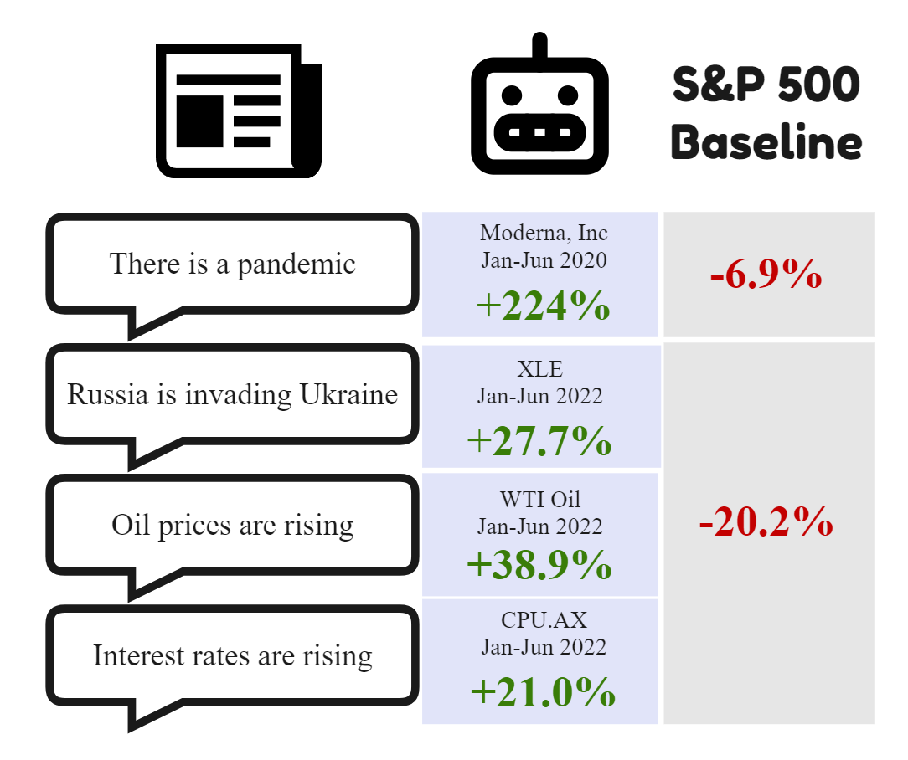

<h1 align="center">Jeremy Tan Jianle</h1>

 AI Engineer | Natural Language Processing | Algorithmic Trader 

<!-- 

  <a href="https://github.com/jeremytanjianle">Github</a> •
  <a href="https://www.linkedin.com/in/jeremy-tan-jianle/">LinkedIn</a>

 -->

  
  

Hey there, I'm Jeremy.  
I love solving hard problems in AI, NLP and in financial trading.  

**Techstack:**  
• Languages: Python, C#, R, Lite-C (Zorro), Easylanguage / Powerlanguage, AFL (Amibroker)  
• ML & AI: Pytorch, Pytorch-lightning, AllenNLP, Spacy, Prodigy, Tensorflow 2  
• Databases: ElasticSearch, MongoDB, PostgreSQL, SAS  
• Cloud: Google Cloud, Paperspace, Digital Ocean, Azure  
• Infrastructure: Docker, Gitlab, Github Actions  

<h2 align="center">Trading</h2>

  

Trading systems achieved live trading returns of 34% returns over a 12 month period with a profit factor of 1.34 and a shallow drawdown of ~6.5%.  
Simulations are updated yearly so there is some overlap. For now, I've ceased trading to focus on my current role.

<h2 align="center">NLP in Finance</h2>

  

The potential for Natural Language Processing in finance is massive.  
My dissertation is on extracting cause-and-effect axioms from historical news that can be used to navigate the future. 
The model is explained below with an intuitive example. 
Certain of how informative such information can be, I look forward to putting aside the time to fully productionize this model one day.  

