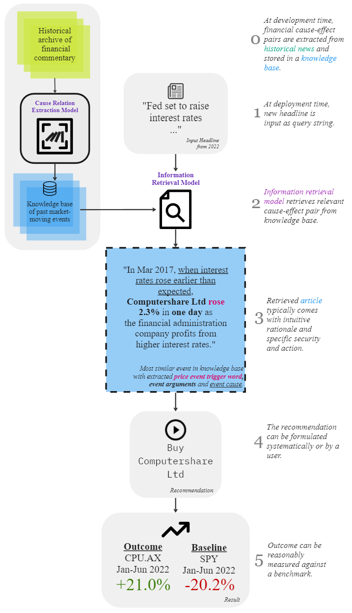

<h1 align="center">Jeremy Tan Jianle</h1>

 AI Engineer | Natural Language Processing | Algorithmic Trader 

<!-- 

  <a href="https://github.com/jeremytanjianle">Github</a> •
  <a href="https://www.linkedin.com/in/jeremy-tan-jianle/">LinkedIn</a>

 -->

  
  

Hey there, I'm Jeremy.  
I love solving hard problems in AI, NLP and in financial trading.  

**Techstack:**  
• Languages: Python, C#, R, Easylanguage / Powerlanguage
• ML, AI & Datascience: Pytorch, AllenNLP, Spacy, Prodigy, Plotly, Dash, Streamlit
• Databases: Clickhouse, ElasticSearch, MongoDB, PostgreSQL, TimescaleDB, QuestDB 
• Cloud: Google Cloud, Paperspace, Azure  
• Infrastructure: Docker, Gitlab, Github Actions, Dagster  

---

<h2 align="center">Trading</h2>

Personal trading systems achieved live returns of 34% returns over a 12 month period with a profit factor of 1.34 and a shallow drawdown of ~6.5%.  
For now, I've ceased trading to focus on my current role.

  

---

<h2 align="center">NLP in Finance</h2>

The potential for Natural Language Processing (NLP) in finance is massive.  
My dissertation is on extracting cause-and-effect axioms from historical news to help navigate the future. 

The model is explained below with an intuitive example.   
I look forward to putting aside the time to fully productionize this model one day.  

<!--    -->