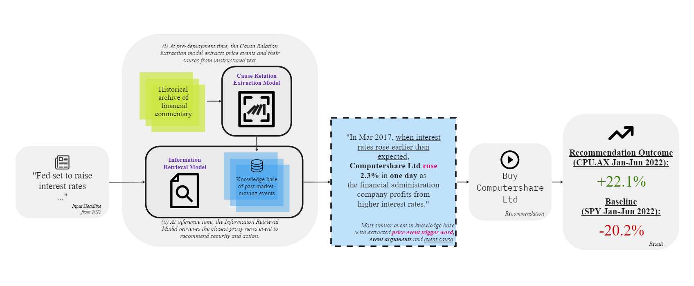

<h1 align="center">Stock Historian: Studying the past to navigate the future</h1>

My masters-level dissertation is on extracting historical cause-and-effect from past financial events to help navigate the future.   

  

More [memes](https://github.com/jeremytanjianle/jeremytanjianle.github.io/blob/main/img/stockhistorianmeme.png) and [examples](https://github.com/jeremytanjianle/jeremytanjianle.github.io/blob/main/img/stock-historian-results.png)

<h2 align="center">How does it work?</h2>  
  

[Read the full dissertation here](https://drive.google.com/file/d/1O-IrLAEKkzGE53Syp8GX7wrIJHeNtoKY/view?usp=drive_link)