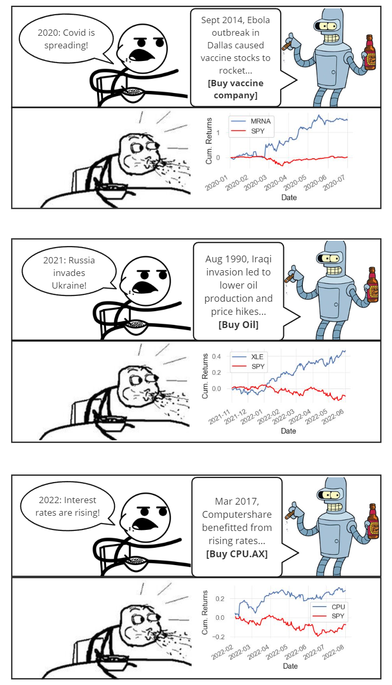

<h1 align="center">Stock Historian: NLP-guided Macro Trading</h1>
>"...the most important events that surprised me, did so because they never happened in my lifetime." ~ Ray Dalio

Ever wish you knew all of financial history to guide your next macro trade?  
*Let AI read history for you!*   
 

  
  
My masters-level dissertation is on extracting historical cause-and-effect from past financial events to help navigate the future.   
[Read the full dissertation here](https://drive.google.com/file/d/1O-IrLAEKkzGE53Syp8GX7wrIJHeNtoKY/view?usp=drive_link)